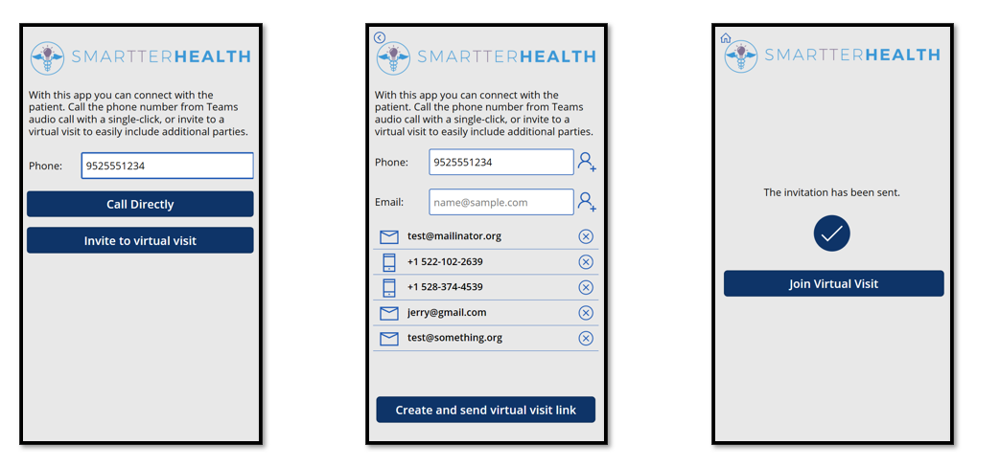

# Project Overview

An application to provide a streamlined interface for various ways of initiating a virtual visit with a person or group of people.

## Use Cases

We built this project to meet multiple needs around connecting with patients through audio/video calls.

### Streamlined "meet now" for virtual visits

When trying to meet virtually with someone, there are multiple channels of engagement, with potentially multiple screens/interfaces involved in setting up and calling/inviting the participant and additional parties (e.g. interpreter, additional family member). There is a desire to have a "simple, single interface" to make engaging in a call easy, without detailed knowledge of how the communication platform works and the nuances of scheduling these different types of engagement.

The application makes it easy to dial out via Teams call, or invite multiple parties via SMS/email to the virtual visit and join that call.

### Launch from EMR applications

For a healthcare proviers, clinicians, and staff, they want to be able to initiate calls from the context of a patient record or specific encounter in the EMR (desktop, mobile, tablet).

The application receives patient contact information (e.g. phone number, email address) directly from the EMR, reducing effort and potential errors involved with copy/paste and entry.

## Power Platform Application sample app

### Prerequisites

The following services are leveraged in the sample solution and may be part of your implementation. For specific questions regarding existing licensing, coverage, or to add services, contact your Microsoft account team.

#### Power Platform

- Get access to a [Power Platform](https://docs.microsoft.com/en-us/power-platform/) environment with Dataverse provisioned and Power Apps premium licenses for users
- Deploy a custom connector to the Power Platform environment when using the Bookings or Advanced Virtual Appointments [Sample connector](https://github.com/microsoft/Virtual-Visit-Sample-Connector)

#### Microsoft Teams

- Microsoft Bookings will need to be configured when Bookings are used for Virtual Appointment scheduling
- Microsoft [Teams Premium](https://learn.microsoft.com/en-us/microsoftteams/enhanced-teams-experience#advanced-virtual-appointments) will be required when using the Advanced Virtual Appointments functionality
- Microsoft Teams with [voice solution](https://learn.microsoft.com/en-us/microsoftteams/cloud-voice-landing-page) will need to be configured when using Teams for direct outbound calling

### Exploring the sample app

Deploy the latest ***Virtual Visit Custom Launcher*** solution file ([/soluiton-file-history](./solution-file-history)) to your Dataverse environment, then Publish and run the *Connect Virtually* app.

Explore the configuration of the solution components via the maker portal. Review the Power Apps canvas and Power Automate workflow used in the sample app.

Try launching the *Connect Virtually* app from its URL and include one or both of the following parameters to simulate launch-from EMR:

- To pass a phone number, use the `personPhone` parameter. e.g. `&personPhone=8885551234` 
- To pass an email address, use the `personEmail` parameter. e.g. `&personEmail=jane@sample.com`

> #### Managed or Unmanaged solutions?
> 
> Both Managed and Unmanaged solutions are available in this repository, as well as the raw source code.
>  - The managed solution offers a one-step uninstallation of all components, but requires more steps to review/edit it in the Power Apps Maker Studio
>  - The unmanaged solution can be reviewed/edited immediately once imported, but will require components to be individually deleted if you wish to remove them from the environment later
>  - The source code folder [/src](/src) is intended for advanced makers (e.g. pro-developers) who prefer to build their own solution or inspect the raw detail that makes up the solution.
 

## Contributing

This project welcomes contributions and suggestions.  Most contributions require you to agree to a
Contributor License Agreement (CLA) declaring that you have the right to, and actually do, grant us
the rights to use your contribution. For details, visit https://cla.opensource.microsoft.com.

When you submit a pull request, a CLA bot will automatically determine whether you need to provide
a CLA and decorate the PR appropriately (e.g., status check, comment). Simply follow the instructions
provided by the bot. You will only need to do this once across all repos using our CLA.

This project has adopted the [Microsoft Open Source Code of Conduct](https://opensource.microsoft.com/codeofconduct/).
For more information see the [Code of Conduct FAQ](https://opensource.microsoft.com/codeofconduct/faq/) or
contact [opencode@microsoft.com](mailto:opencode@microsoft.com) with any additional questions or comments.

## Trademarks

This project may contain trademarks or logos for projects, products, or services. Authorized use of Microsoft 
trademarks or logos is subject to and must follow 
[Microsoft's Trademark & Brand Guidelines](https://www.microsoft.com/en-us/legal/intellectualproperty/trademarks/usage/general).
Use of Microsoft trademarks or logos in modified versions of this project must not cause confusion or imply Microsoft sponsorship.
Any use of third-party trademarks or logos are subject to those third-party's policies.
